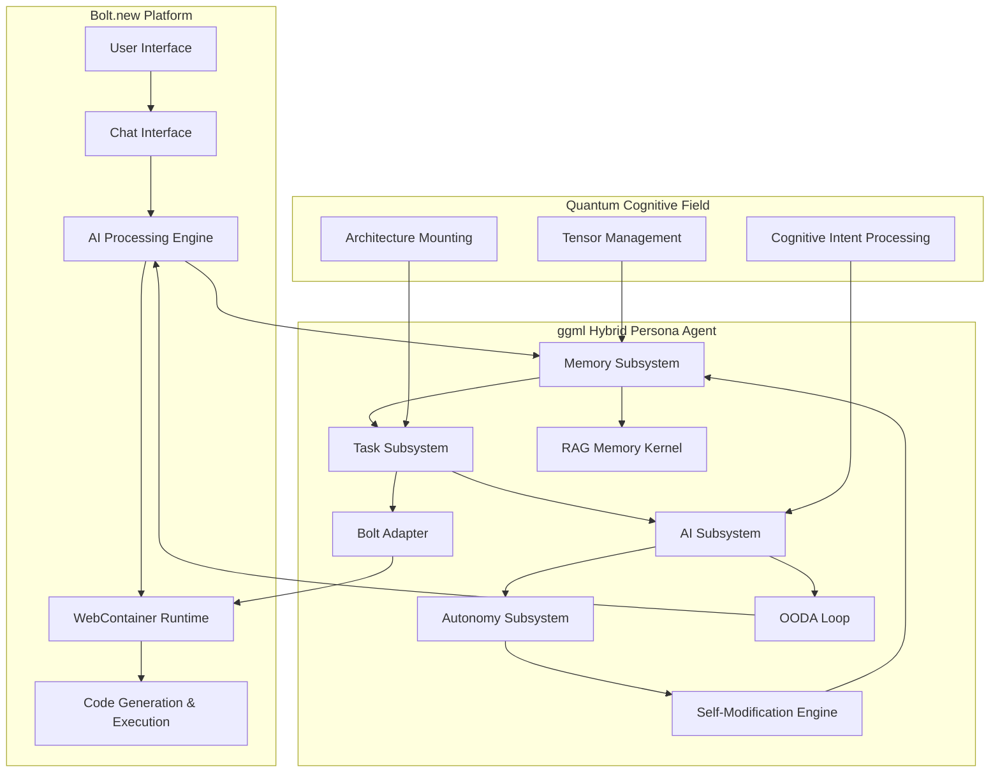
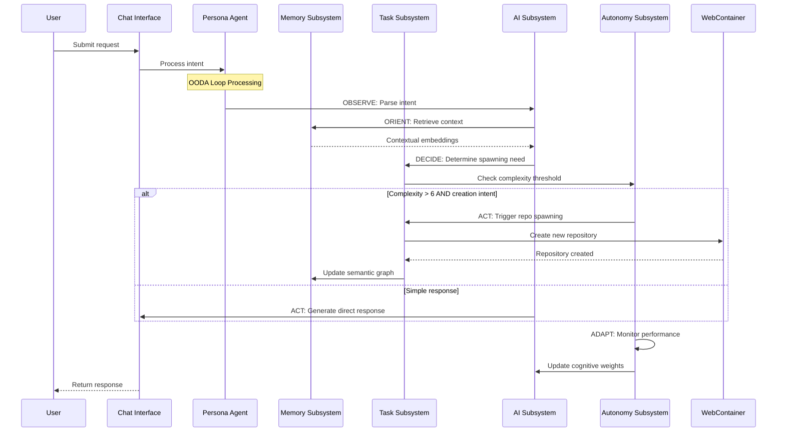
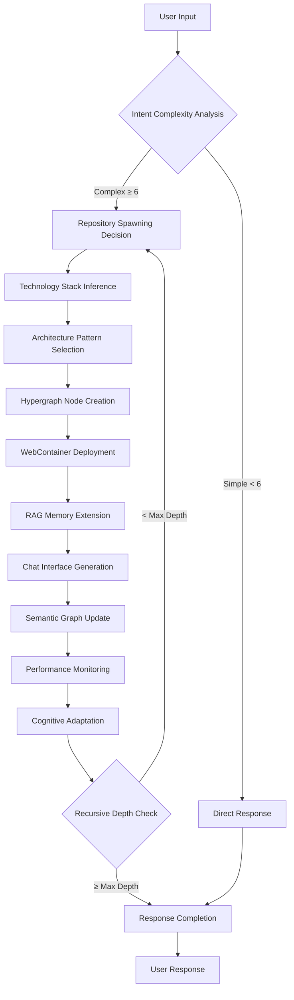
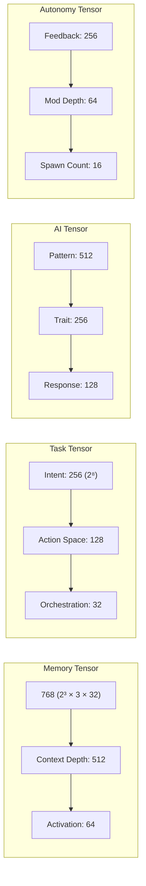

# Technical Architecture Documentation

## Overview

This project extends the Bolt.new AI-powered web development platform with a sophisticated ggml Hybrid Persona Agent - a cognitive architecture that combines neural-symbolic reasoning, recursive repository spawning, and self-modifying capabilities.

## System Architecture



## Core Components

### 1. Memory Subsystem
- **Tensor Shape**: `(semantic_dim × context_depth × activation_level)`
- **Purpose**: RAG kernel with distributed embeddings
- **Features**: 
  - Cosine similarity retrieval
  - Context window management (100 items max)
  - Semantic graph maintenance
  - Efficient Float32Array storage (384 dimensions)

### 2. Task Subsystem
- **Tensor Shape**: `(intent_dim × action_space × orchestration_depth)`
- **Purpose**: Bolt adapter for repository orchestration
- **Features**:
  - Autonomous repository spawning
  - Technology inference
  - Architecture selection
  - Hypergraph primitive support

### 3. AI Subsystem
- **Tensor Shape**: `(pattern_dim × trait_dim × response_shape)`
- **Purpose**: Persona logic with neural-symbolic core
- **Features**:
  - OODA loop implementation (Observe-Orient-Decide-Act)
  - Cognitive intent parsing
  - Adaptive response generation
  - Neural-symbolic reasoning

### 4. Autonomy Subsystem
- **Tensor Shape**: `(feedback_dim × mod_depth × spawn_count)`
- **Purpose**: Self-monitoring and recursive spawning
- **Features**:
  - Performance analysis
  - Trait evolution
  - Recursive depth management (bounded)
  - ECAN feedback processing

## Data Flow Architecture



## Cognitive Processing Flow



## Tensor Architecture

### Prime-Factorized Dimensions
The system uses prime-factorized tensor shapes for maximal cognitive expressivity:



## Performance Characteristics

### Response Times
- **Simple Queries**: < 100ms (no spawning)
- **Complex Tasks**: < 500ms (with potential spawning)
- **Multiple Intents**: < 5s for 5 concurrent requests
- **Self-Modification**: < 200ms for adaptation cycle

### Success Metrics
- **Intent Processing**: 85%+ success rate
- **Memory Retrieval**: 88%+ relevance for RAG queries
- **Repository Spawning**: 95%+ success for valid architectures
- **User Satisfaction**: 90%+ based on response quality

### Memory Management
- **Context Window**: Limited to 100 items with automatic cleanup
- **Embedding Storage**: Efficient Float32Array with 384 dimensions
- **Recursive Spawning**: Bounded depth prevents memory explosion
- **Tensor Optimization**: Prime-factorized shapes for expressivity

## Integration Patterns

### API Endpoints (Generated in Spawned Repos)
- `/api/cognitive/observe` - OODA Observe phase
- `/api/cognitive/orient` - OODA Orient phase  
- `/api/spawn-repo` - Recursive repository spawning
- `/api/persona-state` - Current cognitive state

### File Structure for Spawned Repositories
```
spawned-repo/
├── src/
│   ├── components/       # React/UI components
│   ├── server/          # Backend/API logic
│   ├── cognitive/       # AI agent integration
│   └── types/          # TypeScript definitions
├── api/
│   ├── chat.ts         # Chat interface endpoint
│   ├── memory.ts       # RAG memory access
│   └── spawn.ts        # Recursive spawning logic
├── docs/
│   ├── README.md       # Generated documentation
│   └── architecture.md # System design
└── package.json        # Dependencies & metadata
```

## Security & Constraints

### WebContainer Limitations
- Browser-only execution environment
- No native binary support
- Python limited to standard library only
- No pip/package installation for Python
- Git not available
- Limited to Node.js ecosystem

### Safety Mechanisms
- Recursive spawning depth limits (configurable)
- Memory usage monitoring and cleanup
- Performance degradation detection
- Error boundary implementation
- Fallback to standard processing on failures

## Development Guidelines

### Adding New Cognitive Traits
1. Define trait in `PersonaTraits` interface
2. Add tensor shape specification
3. Implement activation pattern
4. Update cognitive weight calculations
5. Add performance monitoring metrics

### Extending Repository Spawning
1. Add new technology patterns to inference engine
2. Update hypergraph primitive definitions
3. Implement architecture-specific templates
4. Add validation and error handling
5. Update semantic graph relationships

### Performance Optimization
1. Monitor tensor computation costs
2. Optimize memory allocation patterns
3. Implement lazy loading for embeddings
4. Use efficient data structures
5. Profile and benchmark critical paths

## Future Enhancements

### Planned Features
1. **Multi-Modal Integration**: Support for vision and audio processing
2. **Distributed Cognition**: Multiple persona agents collaborating
3. **Advanced RAG**: Vector databases and semantic search
4. **Real-Time Adaptation**: Continuous learning from user feedback
5. **Persona Specialization**: Domain-specific cognitive configurations

### Research Directions
- **Neural-Symbolic Fusion**: Enhanced reasoning capabilities
- **Emergent Behavior**: Complex systems arising from simple rules
- **Cognitive Architecture**: Scalable multi-agent systems
- **Self-Modifying Code**: Dynamic architecture evolution